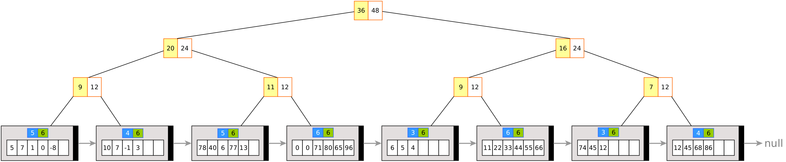

# MiniProyecto1



## Integrantes

* Alonso Bustos Espinoza
* Joaquin San Martin Vargas

## Compilación

* Para compilar el programa se debe ejecutar el siguiente comando en la carpeta raíz del proyecto:

  ``` g++ -o programa main.cpp source/*.cpp -I include ```

* Ejecutar el programa:

    ``` ./programa ```
